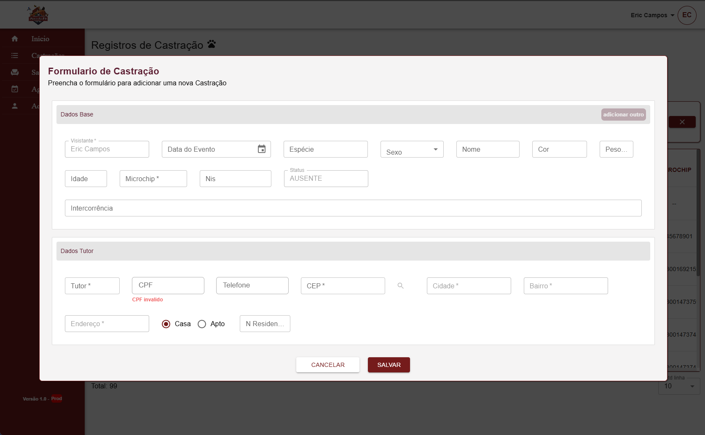

# Projeto de Castração de Animais



## Descrição

O Projeto de Castração de Animais é uma plataforma dedicada a ajudar abrigos e a comunidade a registrar e gerenciar o processo de castração de animais. O objetivo é facilitar o agendamento e o acompanhamento das castrações, garantindo um manejo responsável e humanitário para os animais.

**Nota:** Devido à natureza confidencial de algumas partes do projeto, certos componentes e funcionalidades não estarão disponíveis no repositório público, pois fazem parte de entregas personalizadas para o cliente.

## Tecnologias Utilizadas

- **Frontend**: React.js, HTML, CSS, JavaScript
- **Backend**: Node.js, Express.js
- **Banco de Dados**: MongoDB
- **Autenticação**: JWT (JSON Web Tokens)
- **Versionamento de Código**: Git, GitHub
- **Arquitetura**: (MVC, Layered Architecture)

## Funcionalidades

- **Cadastro de Usuários**: Usuários podem se registrar e fazer login para gerenciar suas informações.
- **Gerenciamento de Animais**: Abrigos e veterinários podem adicionar, editar e remover informações sobre os animais castrados e a serem castrados.
- **Agendamento de Castrações**: Usuários podem agendar castrações.
- **Autenticação e Autorização**: Sistema de roles e permissions para gerenciar o acesso a diferentes funcionalidades da plataforma.

## Como Executar o Projeto

### Pré-requisitos

- Node.js (v14 ou superior)
- MongoDB

### Instalação

1. Clone o repositório:

   ```bash
   git clone https://github.com/ericcampos321/castracao-backend.git
